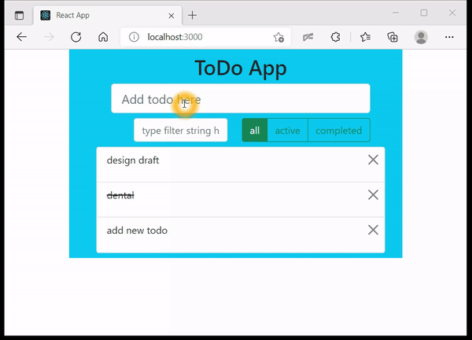

## Build a React To-do List App

Date: Dec 1, 2021

Keywords: JavaScript, typescript, redux-saga, react-bootstrap, react, todo app

GitHub: https://github.com/licanhua/react-todo

## Overview
[react-todo](https://github.com/licanhua/react-todo) is a react project pratice with `react` + `typescript` + `redux-saga` + `react-bootstrap`

## Guide
[Tips to build a Todo app with react, redux-saga, typescript and react-bootstrap — 1](https://licanhua.medium.com/tips-to-build-a-todo-app-with-react-redux-saga-typescript-and-react-bootstrap-1-468058add83c?sk=f981bdeeee489268db8e93e5083e7daf)

## Demo site
https://licanhua.github.io/react-todo/

## Youtube demo

## Medium
[medium](https://licanhua.medium.com/tips-to-build-a-todo-app-with-react-redux-saga-typescript-and-react-bootstrap-1-468058add83c)
